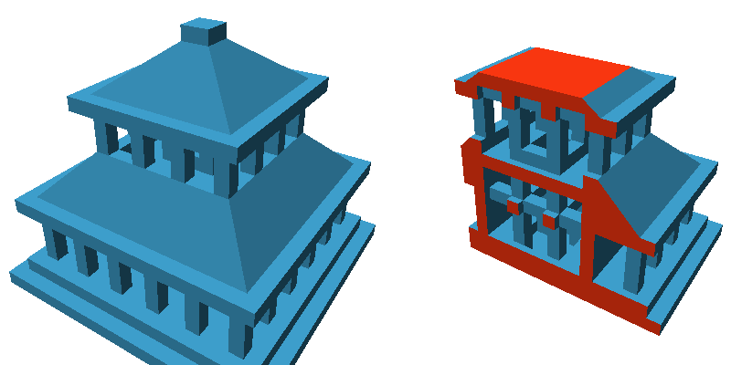
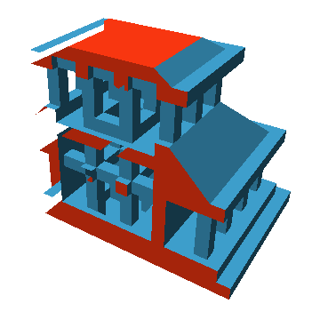

clipping-with-caps
==================

### Clipping a mesh and covering the openings with caps in WebGL ###

[View the demo](http://daign.github.io/clipping-with-caps/)

Licensed under [MIT License](./LICENSE)

Dependencies:
* [three.js](https://github.com/mrdoob/three.js)

---

Clipping meshes inside a shader program is fast and avoids triangulation problems that can arise
when actually constructing a clipped mesh with constructive solid geometry.
But since a mesh is just a hollow hull of triangles the clipped object will have an opening along
the clipping edge.
It is however possible to visually close this gaps without actually constructing the cap faces.

When there is just one clipping plane on an otherwise closed mesh and backface rendering is enabled,
then there are backsides visible through the whole opening.
Rendered into a stencil this area can be used to define where to render the caps.
First a scene showing only the backfaces is used to increment the stencil and then another scene
showing the front faces decrements the stencil.
The resulting stencil is applied to a scene rendering a plane at the location of the clipping plane.

But this method fails when there is more than one clipping plane.
Because clipping planes facing away from the camera result in hidden backfaces, these areas are
missing in the stencil.
The result would look like this:

The solution is to use a different shader for rendering the stencil areas, that only clipps at
clipping planes facing the camera.
Since the camera position is known it can be calculated in the shader whether a clipping plane is
facing towards the camera or away from it.

